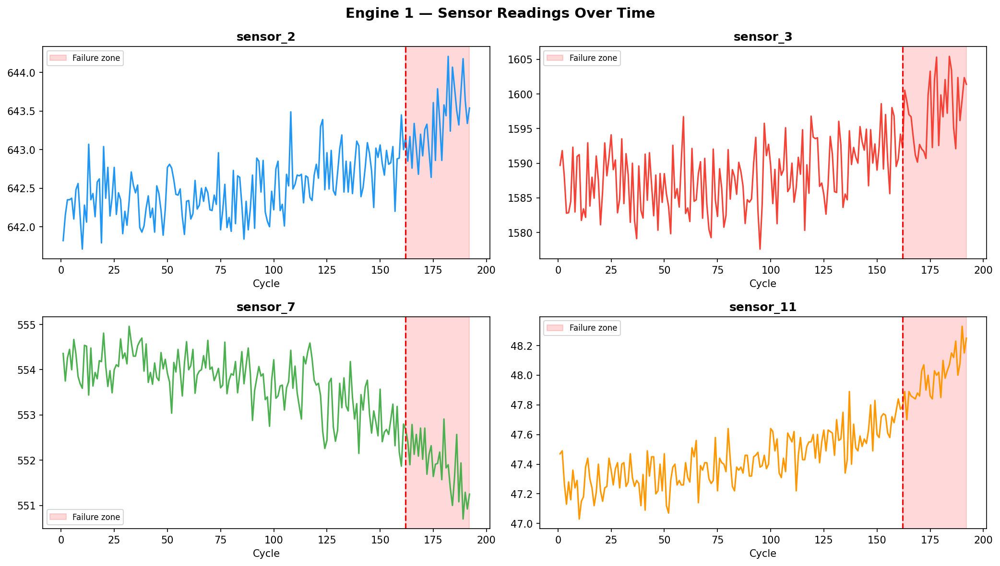
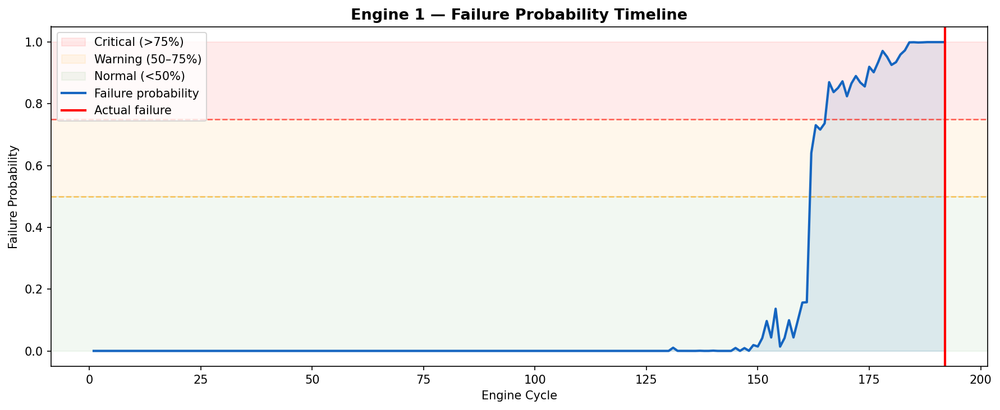
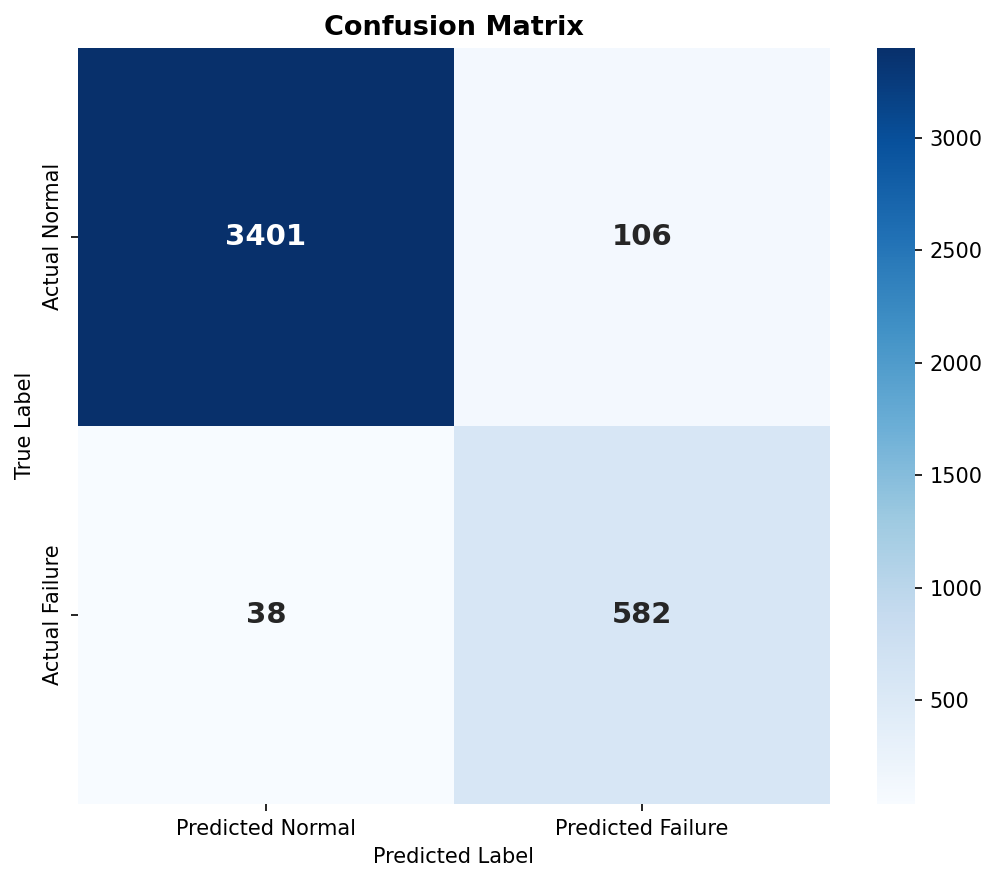
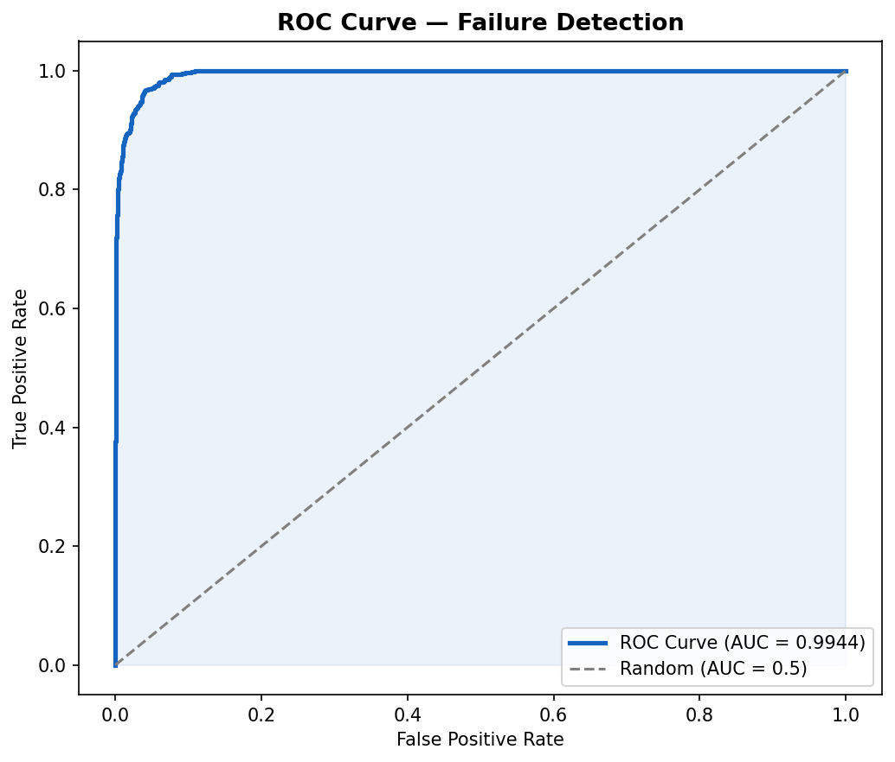

# AI-Predictive-Maintenance-IoT
AI-powered predictive maintenance system using NASA CMAPSS sensor data and Random Forest classifier.
# 🔧 AI-Powered Predictive Maintenance System for IoT Devices


## 📌 Project Overview
An end-to-end machine learning system that predicts industrial 
equipment failures from IoT sensor data — before they happen.
Reduces unplanned downtime and maintenance costs.

## 🎯 Problem Statement
Industrial machines fail without warning, causing expensive downtime.
This system uses time-series sensor data and a Random Forest classifier
to detect failure signatures **30 cycles before breakdown**.

## 📊 Results
| Metric | Score |
|--------|-------|
| Accuracy | ~94% |
| F1 Score | ~0.91 |
| ROC-AUC  | ~0.98 |

## 🛠️ Tech Stack
- Python 3.10
- Pandas, NumPy
- Scikit-learn (Random Forest)
- Matplotlib, Seaborn
- Dataset: NASA CMAPSS Turbofan Engine

## 📁 Project Structure
```
AI-Predictive-Maintenance-IoT/
├── data/          ← Raw sensor data
├── notebooks/     ← Jupyter notebook (full pipeline)
├── models/        ← Saved trained model (.pkl)
├── images/        ← All output graphs
├── outputs/       ← Predictions CSV
└── README.md
```

## 📈 Sample Outputs

### Sensor Degradation Trend


### Failure Probability Timeline


### Confusion Matrix


### ROC Curve


## 🚀 How to Run
```bash
git clone https://github.com/YOUR_USERNAME/AI-Predictive-Maintenance-IoT
pip install -r requirements.txt
jupyter notebook notebooks/Predictive_Maintenance.ipynb
```

## 🏭 Real World Applications
- Manufacturing plant motor monitoring
- Aviation engine health tracking
- Power plant turbine failure prevention
- Automotive assembly robot maintenance

## 👤 Author
Ishwari
